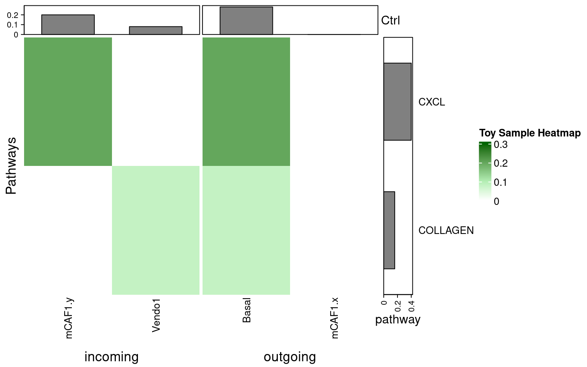
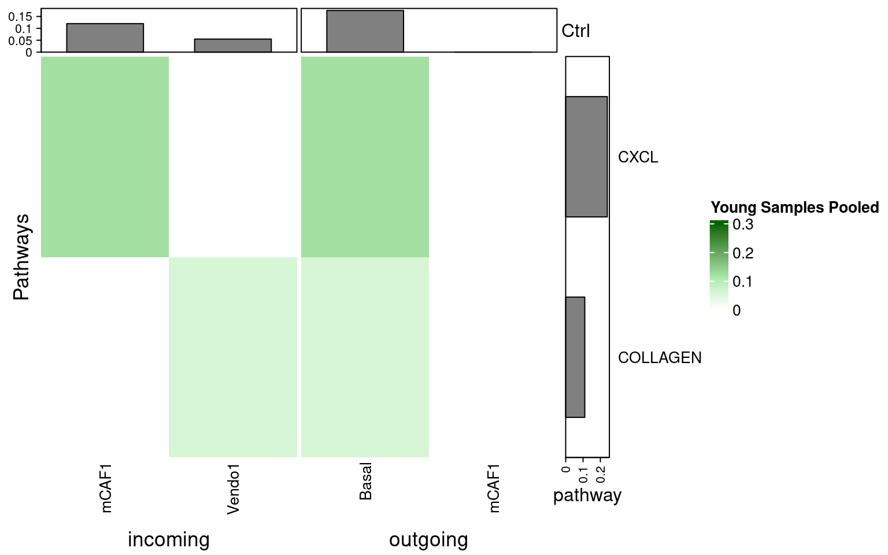
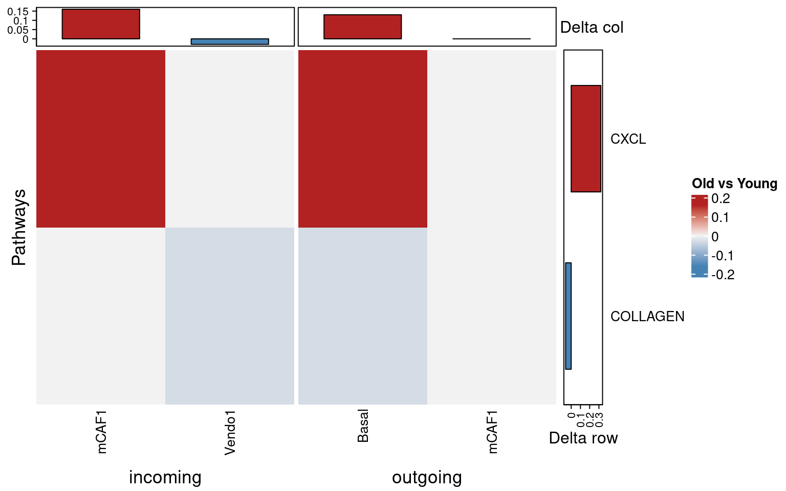
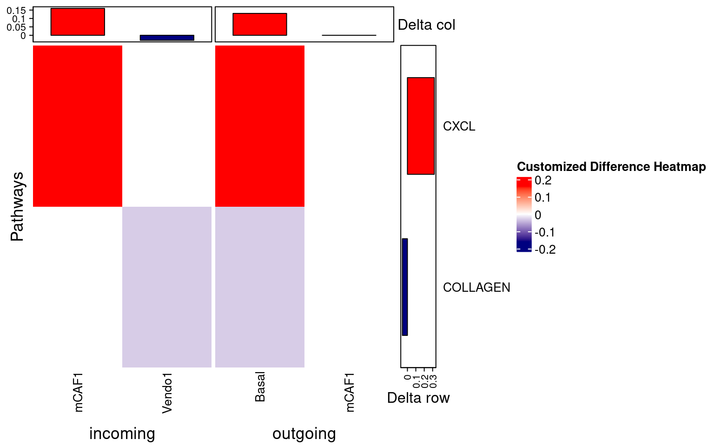

# CellChatCustomPlots

`CellChatCustomPlots` provides custom plotting helpers for CellChat
objects, with an emphasis on heatmaps and pooled summaries across
multiple samples.

The package is useful when CellChat has been run separately for each
patient or sample and you want to:

  - plot selected source and target cell types
  - pool communication probabilities across multiple CellChat objects
  - compare pathway communication between two conditions
  - extract ligand-receptor interaction data for custom bubble plots

## Installation

Install from GitHub:

``` r
install.packages("remotes")
remotes::install_github("lkroeh/CellChatCustomPlots")
```

Load the package:

``` r
library(CellChatCustomPlots)
library(circlize)
library(ComplexHeatmap)
```

## Main Functions

| Function                     | Description                                               |
| ---------------------------- | --------------------------------------------------------- |
| `prephm()`                   | Preprocess CellChat pathway probability data for heatmaps |
| `makehm()`                   | Create a heatmap from one CellChat object                 |
| `makehm_pooled()`            | Create a pooled heatmap across multiple CellChat objects  |
| `makehm_pooled_onepathway()` | Create a pooled heatmap for one signaling pathway         |
| `get_avg_df()`               | Average pathway probabilities across CellChat objects     |
| `makehm_compareconditions()` | Create a differential heatmap between two conditions      |
| `extract_cellchat_data()`    | Extract ligand-receptor interaction data across objects   |

## Small Toy Data

The heatmap functions use the `@netP$prob` slot from CellChat objects.
The examples below use tiny CellChat-like S4 objects with only that slot
so the README can render quickly.

``` r
setClass("ToyCellChat", slots = c(netP = "list"))

make_toy_cellchat <- function(values,
                              sources = c("Basal", "mCAF1", "Vendo1"),
                              targets = c("Basal", "mCAF1", "Vendo1"),
                              pathways = c("CXCL", "COLLAGEN", "LAMININ", "MHC-I")) {
  prob <- array(
    0,
    dim = c(length(sources), length(targets), length(pathways)),
    dimnames = list(
      source = sources,
      target = targets,
      pathway_name = pathways
    )
  )

  for (value in values) {
    prob[value$source, value$target, value$pathway] <- value$prob
  }

  new("ToyCellChat", netP = list(prob = prob))
}

toy_sample <- make_toy_cellchat(list(
  list(source = "Basal", target = "mCAF1", pathway = "CXCL", prob = 0.20),
  list(source = "Basal", target = "Vendo1", pathway = "COLLAGEN", prob = 0.08),
  list(source = "mCAF1", target = "Basal", pathway = "LAMININ", prob = 0.12),
  list(source = "Vendo1", target = "mCAF1", pathway = "MHC-I", prob = 0.06)
))

young_objects <- list(
  young1 = make_toy_cellchat(list(
    list(source = "Basal", target = "mCAF1", pathway = "CXCL", prob = 0.10),
    list(source = "Basal", target = "Vendo1", pathway = "COLLAGEN", prob = 0.05),
    list(source = "mCAF1", target = "Basal", pathway = "LAMININ", prob = 0.12)
  )),
  young2 = make_toy_cellchat(list(
    list(source = "Basal", target = "mCAF1", pathway = "CXCL", prob = 0.14),
    list(source = "Basal", target = "Vendo1", pathway = "COLLAGEN", prob = 0.06),
    list(source = "mCAF1", target = "Basal", pathway = "LAMININ", prob = 0.10)
  ))
)

old_objects <- list(
  old1 = make_toy_cellchat(list(
    list(source = "Basal", target = "mCAF1", pathway = "CXCL", prob = 0.30),
    list(source = "Basal", target = "Vendo1", pathway = "COLLAGEN", prob = 0.03),
    list(source = "mCAF1", target = "Basal", pathway = "LAMININ", prob = 0.04),
    list(source = "Vendo1", target = "mCAF1", pathway = "MHC-I", prob = 0.15)
  )),
  old2 = make_toy_cellchat(list(
    list(source = "Basal", target = "mCAF1", pathway = "CXCL", prob = 0.26),
    list(source = "Basal", target = "Vendo1", pathway = "COLLAGEN", prob = 0.02),
    list(source = "mCAF1", target = "Basal", pathway = "LAMININ", prob = 0.05),
    list(source = "Vendo1", target = "mCAF1", pathway = "MHC-I", prob = 0.12)
  ))
)

sources <- c("Basal", "mCAF1")
targets <- c("mCAF1", "Vendo1")

col_fun <- circlize::colorRamp2(
  c(0, 0.1, 0.3),
  c("white", "darkseagreen2", "darkgreen")
)
```

## Single Sample Heatmap

``` r
result <- makehm(
  cellchatobj = toy_sample,
  col_fun     = col_fun,
  sources     = sources,
  targets     = targets,
  fontsize    = 10,
  hmtitle     = "Toy Sample Heatmap"
)

ComplexHeatmap::draw(result[[2]])
```



## Pooled Heatmap

``` r
result_pooled <- makehm_pooled(
  all_objects_list = young_objects,
  col_fun          = col_fun,
  sources          = sources,
  targets          = targets,
  fontsize         = 10,
  hmtitle          = "Young Samples Pooled",
  min_rowsum       = 0.01,
  pool_fun         = "mean"
)

ComplexHeatmap::draw(result_pooled[[2]])
```



Use `pool_fun = "mean"` to average communication probabilities across
objects instead of summing them.

## Differential Heatmap Between Conditions

``` r
results_diff <- makehm_compareconditions(
  list_ctrl  = young_objects,
  list_treat = old_objects,
  sources    = sources,
  targets    = targets,
  fontsize   = 10,
  hmtitle    = "Old vs Young",
  min_rowsum = 0.01,
  row_order  = "absolute_change"
)

ComplexHeatmap::draw(results_diff$heatmap)
```



Positive values in `diff_mat` indicate higher communication in the
treatment condition. Negative values indicate higher communication in
the control condition.

## Customization

`makehm_compareconditions()` supports several plotting options:

``` r
results_custom <- makehm_compareconditions(
  list_ctrl        = young_objects,
  list_treat       = old_objects,
  sources          = sources,
  targets          = targets,
  fontsize         = 10,
  hmtitle          = "Customized Difference Heatmap",
  min_rowsum       = 0.01,
  neg_col          = "navy",
  mid_col          = "white",
  pos_col          = "red",
  row_order        = "treat_increased",
  cluster_rows     = FALSE,
  cluster_columns  = FALSE,
  show_row_barplot = TRUE,
  show_col_barplot = TRUE,
  show_row_labels  = TRUE
)

ComplexHeatmap::draw(results_custom$heatmap)
```



`makehm_pooled()` also supports customization of row filtering, pooling,
clustering, annotations, and column labels.

## Example Data

The package also includes example CellChat objects:

``` r
data("example_CellChat_list")
data("example_DB")

length(example_CellChat_list)
names(example_CellChat_list)
```

## Ligand-Receptor Bubble Plot Data

`extract_cellchat_data()` can extract CellChat ligand-receptor
interaction data across multiple objects for custom plotting:

``` r
objects_with_db <- lapply(example_CellChat_list, function(obj) {
  obj@DB <- example_DB
  obj
})

lr_data <- extract_cellchat_data(
  all_objects_list = objects_with_db,
  sources.use      = sources,
  targets.use      = targets,
  signaling        = "CXCL"
)

head(lr_data)
```

## Website

Documentation is available at:

<https://lkroeh.github.io/CellChatCustomPlots>

## License

GPL-3
