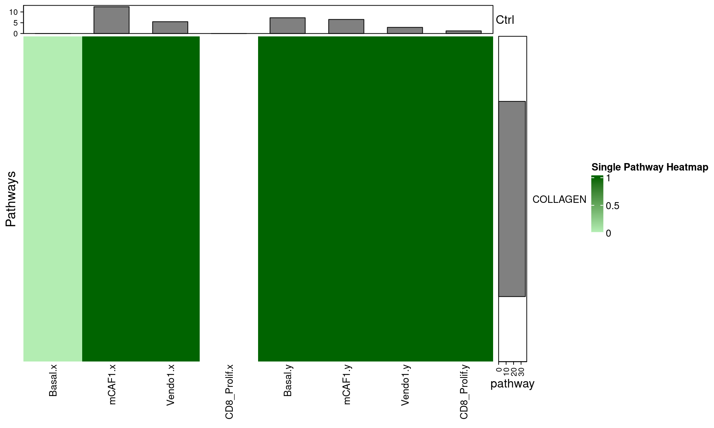

# CellChatCustomPlots

`CellChatCustomPlots` provides custom plotting helpers for CellChat objects,
with an emphasis on heatmaps and pooled summaries across multiple samples.

The package is useful when CellChat has been run separately for each patient or
sample and you want to:

- plot selected source and target cell types
- pool communication probabilities across multiple CellChat objects
- compare pathway communication between two conditions
- extract ligand-receptor interaction data for custom bubble plots

## Installation

Install from GitHub:

```r
install.packages("remotes")
remotes::install_github("lkroeh/CellChatCustomPlots")
```

Load the package:

```r
library(CellChatCustomPlots)
```

## Main Functions

| Function | Description |
|----------|-------------|
| `prephm()` | Preprocess CellChat pathway probability data for heatmaps |
| `makehm()` | Create a heatmap from one CellChat object |
| `makehm_pooled()` | Create a pooled heatmap across multiple CellChat objects |
| `makehm_pooled_onepathway()` | Create a pooled heatmap for one signaling pathway |
| `get_avg_df()` | Average pathway probabilities across CellChat objects |
| `makehm_compareconditions()` | Create a differential heatmap between two conditions |
| `extract_cellchat_data()` | Extract ligand-receptor interaction data across objects |

## Example Plots

The package site includes rendered examples:




## Example Data

The package includes example CellChat objects:

```r
data("example_CellChat_list")
data("example_DB")

length(example_CellChat_list)
names(example_CellChat_list)
```

## Single Sample Heatmap

```r
library(circlize)
library(ComplexHeatmap)

sources <- c("mCAF1", "Basal", "CD8_Prolif", "Vendo1")
targets <- c("mCAF1", "Basal", "CD8_Prolif", "Vendo1")

col_fun <- circlize::colorRamp2(
  c(0, 0.005, 1),
  c("white", "darkseagreen2", "darkgreen")
)

result <- makehm(
  cellchatobj = example_CellChat_list[[1]],
  col_fun     = col_fun,
  sources     = sources,
  targets     = targets,
  fontsize    = 10,
  hmtitle     = "Sample Heatmap"
)

ComplexHeatmap::draw(result[[2]])
```

## Pooled Heatmap

```r
result_pooled <- makehm_pooled(
  all_objects_list = example_CellChat_list,
  col_fun          = col_fun,
  sources          = sources,
  targets          = targets,
  fontsize         = 10,
  hmtitle          = "Pooled Heatmap",
  min_rowsum       = 0.05,
  pool_fun         = "sum"
)

ComplexHeatmap::draw(result_pooled[[2]])
```

Use `pool_fun = "mean"` to average communication probabilities across objects
instead of summing them.

## Differential Heatmap Between Conditions

```r
results_diff <- makehm_compareconditions(
  list_ctrl  = young_objects,
  list_treat = old_objects,
  sources    = c("Basal_EMT_adhesion", "Basal_EMT_Prolif"),
  targets    = c("mCAF1", "mCAF2"),
  fontsize   = 12,
  hmtitle    = "Old vs Young",
  min_rowsum = 0.01,
  row_order  = "absolute_change"
)

ComplexHeatmap::draw(results_diff$heatmap)
results_diff$diff_mat
```

Positive values in `diff_mat` indicate higher communication in the treatment
condition. Negative values indicate higher communication in the control
condition.

## Customization

`makehm_compareconditions()` supports several plotting options:

```r
results_custom <- makehm_compareconditions(
  list_ctrl        = young_objects,
  list_treat       = old_objects,
  sources          = sources,
  targets          = targets,
  fontsize         = 10,
  hmtitle          = "Customized Difference Heatmap",
  neg_col          = "navy",
  mid_col          = "white",
  pos_col          = "red",
  row_order        = "treat_increased",
  cluster_rows     = FALSE,
  cluster_columns  = FALSE,
  show_row_barplot = TRUE,
  show_col_barplot = TRUE,
  show_row_labels  = TRUE
)
```

`makehm_pooled()` also supports customization of row filtering, pooling,
clustering, annotations, and column labels.

## Ligand-Receptor Bubble Plot Data

`extract_cellchat_data()` can extract CellChat ligand-receptor interaction data
across multiple objects for custom plotting:

```r
objects_with_db <- lapply(example_CellChat_list, function(obj) {
  obj@DB <- example_DB
  obj
})

lr_data <- extract_cellchat_data(
  all_objects_list = objects_with_db,
  sources.use      = sources,
  targets.use      = targets,
  signaling        = "CXCL"
)

head(lr_data)
```

## Rendering README Plots

`README.Rmd` contains executable chunks that generate README figures under
`man/figures/`. To refresh the rendered README and plot images, run:

```r
devtools::build_readme()
```

Then commit `README.md`, `README.Rmd`, and `man/figures/`.

## Website

Documentation is available at:

<https://lkroeh.github.io/CellChatCustomPlots>

## License

GPL-3
