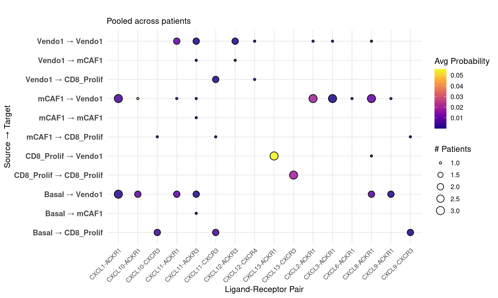

# Introduction to CellChatCustomPlots

## Overview

`CellChatCustomPlots` provides custom heatmap and bubble plot
visualizations for CellChat objects to explore cell-cell communication
patterns across single or multiple
samples.

### Functions

| Function                     | Description                                |
| ---------------------------- | ------------------------------------------ |
| `prephm()`                   | Preprocess CellChat data for heatmap       |
| `makehm()`                   | Heatmap for a single CellChat object       |
| `makehm_pooled()`            | Pooled heatmap across multiple objects     |
| `makehm_pooled_onepathway()` | Pooled heatmap for one pathway             |
| `extract_cellchat_data()`    | Extract LR interaction data across objects |

-----

## Load the Package and Example Data

``` r
library(CellChatCustomPlots)

data("example_CellChat_list")
data("example_DB")

length(example_CellChat_list)
#> [1] 5
names(example_CellChat_list)
#> [1] "bill1"   "bill6"   "peng5"   "peng2"   "kurten5"

# Available cell types
dimnames(example_CellChat_list[[1]]@netP$prob)[[1]]
#> [1] "Basal"      "mCAF1"      "CXCL8_iCAF" "Vendo1"

# Available pathways
dimnames(example_CellChat_list[[1]]@netP$prob)[[3]]
#>  [1] "COLLAGEN" "MHC-I"    "MHC-II"   "CXCL"     "MK"       "CD99"    
#>  [7] "FN1"      "LAMININ"  "CCL"      "APP"
```

## Single Sample Heatmap

``` r

library(circlize)
#> ========================================
#> circlize version 0.4.16
#> CRAN page: https://cran.r-project.org/package=circlize
#> Github page: https://github.com/jokergoo/circlize
#> Documentation: https://jokergoo.github.io/circlize_book/book/
#> 
#> If you use it in published research, please cite:
#> Gu, Z. circlize implements and enhances circular visualization
#>   in R. Bioinformatics 2014.
#> 
#> This message can be suppressed by:
#>   suppressPackageStartupMessages(library(circlize))
#> ========================================

# Define sources and targets
sources <- c("mCAF1", "Basal", "CD8_Prolif", "Vendo1")  # replace with your cell types
targets <- c("mCAF1", "Basal","CD8_Prolif", "Vendo1")  # replace with your cell types

# Define color scale
col_fun = circlize::colorRamp2(c(0, 0.005, 1), c("white", "darkseagreen2", "darkgreen"))

result <- makehm(
  cellchatobj = example_CellChat_list[[1]],
  col_fun     = col_fun,
  sources     = sources,
  targets     = targets,
  fontsize    = 10,
  hmtitle     = "Sample Heatmap"
)

# Draw the heatmap
ComplexHeatmap::draw(result[[2]])
```


``` r

# Inspect the data matrix
head(result[[3]])
#>             Basal.x    mCAF1.x  Vendo1.x    Basal.y    mCAF1.y   Vendo1.y
#> COLLAGEN 0.00000000 4.94387884 1.9266054 1.28925132 3.99558782 1.58564514
#> LAMININ  0.44126810 1.14823761 1.4925551 0.46527477 1.18592376 1.43086228
#> FN1      0.00000000 0.84317450 0.0000000 0.10541061 0.40527967 0.33248422
#> CD99     0.07063680 0.29290094 0.3422526 0.06492148 0.27417717 0.36669166
#> MK       0.08089036 0.03359809 0.1003275 0.05662773 0.07675255 0.08143571
#> APP      0.02023613 0.06046706 0.1217141 0.00000000 0.10082451 0.10159276
```

## Multi Sample Heatmap

``` r
result_pooled <- makehm_pooled(
  all_objects_list = example_CellChat_list,
  col_fun          = col_fun,
  sources          = sources,
  targets          = targets,
  fontsize         = 10,
  hmtitle          = "Pooled Heatmap"
)

ComplexHeatmap::draw(result_pooled[[2]])
```


## Multi Sample Heatmap One Pathway

``` r

# Use first available pathway
pathway_of_interest <- dimnames(example_CellChat_list[[1]]@netP$prob)[[3]][1]

result_pathway <- makehm_pooled_onepathway(
  all_objects_list = example_CellChat_list,
  col_fun          = col_fun,
  sources          = sources,
  targets          = targets,
  fontsize         = 10,
  pathway          = pathway_of_interest,
  hmtitle          = "Single Pathway Heatmap"
)

ComplexHeatmap::draw(result_pathway[[2]])
```


## Bubble Plot

``` r

# Re-attach DB before using extract_cellchat_data
objects_with_db <- lapply(example_CellChat_list, function(obj) {
  obj@DB <- example_DB
  return(obj)
})
#> Loading required namespace: CellChat

lr_data <- extract_cellchat_data(
  all_objects_list = objects_with_db,
  sources.use      = sources,
  targets.use      = targets,
  signaling        = "CXCL" #dimnames(example_CellChat_list[[1]]@netP$prob)[[3]][1]
)
#> Processing: bill1
#> Comparing communications on a single object
#>   -> ADDED 22 rows
#> Processing: bill6
#> Comparing communications on a single object
#>   -> ADDED 17 rows
#> Processing: peng5
#> Comparing communications on a single object
#>   -> ADDED 19 rows
#> Processing: peng2
#> Comparing communications on a single object
#>   -> ADDED 36 rows
#> Processing: kurten5
#> Comparing communications on a single object
#>   -> ADDED 24 rows
#> Total: 118 interactions extracted

head(lr_data)
#>    source target ligand receptor      prob pval interaction_name
#> 1   Basal Vendo1  CXCL1    ACKR1 0.1847115    3      CXCL1_ACKR1
#> 2   mCAF1 Vendo1  CXCL1    ACKR1 0.2258684    3      CXCL1_ACKR1
#> 10  mCAF1  mCAF1   <NA>     <NA>        NA    1             <NA>
#> 11  mCAF1  Basal   <NA>     <NA>        NA    1             <NA>
#> 12  mCAF1   <NA>   <NA>     <NA>        NA    1             <NA>
#> 13  Basal  mCAF1   <NA>     <NA>        NA    1             <NA>
#>    interaction_name_2 pathway_name         annotation       evidence
#> 1       CXCL1 - ACKR1         CXCL Secreted Signaling PMID: 26740381
#> 2       CXCL1 - ACKR1         CXCL Secreted Signaling PMID: 26740381
#> 10      CXCL1 - ACKR1         <NA>               <NA>           <NA>
#> 11      CXCL1 - ACKR1         <NA>               <NA>           <NA>
#> 12      CXCL1 - ACKR1         <NA>               <NA>           <NA>
#> 13      CXCL1 - ACKR1         <NA>               <NA>           <NA>
#>      source.target prob.original patient
#> 1  Basal -> Vendo1   0.004454465   bill1
#> 2  mCAF1 -> Vendo1   0.011946021   bill1
#> 10  mCAF1 -> mCAF1            NA   bill1
#> 11  mCAF1 -> Basal            NA   bill1
#> 12            <NA>            NA   bill1
#> 13  Basal -> mCAF1            NA   bill1

#plot
bubble_data <- lr_data %>%
  group_by(source, target, ligand, receptor, interaction_name) %>%
  summarise(
    prob_avg = mean(prob.original, na.rm = TRUE),
    n_patients = n_distinct(patient),
    .groups = 'drop'
  ) %>%
  dplyr::filter(prob_avg > 0, n_patients > 0)

# Create interaction label
bubble_data$interaction_label <- paste0(bubble_data$ligand, "-", bubble_data$receptor)

# Bubble plot: size = # patients, color = avg prob
p1 <- ggplot(bubble_data, 
             aes(#x = reorder(interaction_label, prob_avg), 
               x = interaction_label,
                 y = paste(source, "→", target), 
                 size = n_patients,      # Size by # patients
                 fill = prob_avg)) +     # Color by avg probability
  geom_point(shape = 21, stroke = 0.8, alpha = 0.85) +
  scale_size_continuous(range = c(1, 5), name = "# Patients") +
  scale_fill_viridis_c(name = "Avg Probability", option = "plasma") +
  labs(title = "",
       subtitle = "Pooled across patients",
       x = "Ligand-Receptor Pair", y = "Source → Target") +
  theme_minimal(base_size = 12) +
  theme(axis.text.x = element_text(angle = 45, hjust = 1, size = 9),
        axis.text.y = element_text(size = 11, face = "bold"),
        legend.position = "right") 

print(p1)
```



## Create Small Toy CellChat-Like Objects

The heatmap functions use the `@netP$prob` slot from CellChat objects.
For small examples, you can create tiny CellChat-like S4 objects with
only that slot.

``` r
setClass("ToyCellChat", slots = c(netP = "list"))

make_toy_cellchat <- function(values,
                              sources = c("Basal", "mCAF1", "Vendo1"),
                              targets = c("Basal", "mCAF1", "Vendo1"),
                              pathways = c("CXCL", "COLLAGEN", "LAMININ", "MHC-I")) {
  prob <- array(
    0,
    dim = c(length(sources), length(targets), length(pathways)),
    dimnames = list(
      source = sources,
      target = targets,
      pathway_name = pathways
    )
  )

  for (value in values) {
    prob[value$source, value$target, value$pathway] <- value$prob
  }

  new("ToyCellChat", netP = list(prob = prob))
}

young_objects <- list(
  young1 = make_toy_cellchat(list(
    list(source = "Basal", target = "mCAF1", pathway = "CXCL", prob = 0.10),
    list(source = "Basal", target = "Vendo1", pathway = "COLLAGEN", prob = 0.05),
    list(source = "mCAF1", target = "Basal", pathway = "LAMININ", prob = 0.12)
  )),
  young2 = make_toy_cellchat(list(
    list(source = "Basal", target = "mCAF1", pathway = "CXCL", prob = 0.14),
    list(source = "Basal", target = "Vendo1", pathway = "COLLAGEN", prob = 0.06),
    list(source = "mCAF1", target = "Basal", pathway = "LAMININ", prob = 0.10)
  ))
)

old_objects <- list(
  old1 = make_toy_cellchat(list(
    list(source = "Basal", target = "mCAF1", pathway = "CXCL", prob = 0.30),
    list(source = "Basal", target = "Vendo1", pathway = "COLLAGEN", prob = 0.03),
    list(source = "mCAF1", target = "Basal", pathway = "LAMININ", prob = 0.04),
    list(source = "Vendo1", target = "mCAF1", pathway = "MHC-I", prob = 0.15)
  )),
  old2 = make_toy_cellchat(list(
    list(source = "Basal", target = "mCAF1", pathway = "CXCL", prob = 0.26),
    list(source = "Basal", target = "Vendo1", pathway = "COLLAGEN", prob = 0.02),
    list(source = "mCAF1", target = "Basal", pathway = "LAMININ", prob = 0.05),
    list(source = "Vendo1", target = "mCAF1", pathway = "MHC-I", prob = 0.12)
  ))
)

toy_sources <- c("Basal", "mCAF1")
toy_targets <- c("mCAF1", "Vendo1")
```

## Differential Heatmap Between Conditions

``` r
result_diff <- makehm_compareconditions(
  list_ctrl  = young_objects,
  list_treat = old_objects,
  sources    = toy_sources,
  targets    = toy_targets,
  fontsize   = 10,
  hmtitle    = "Old vs Young",
  min_rowsum = 0.01,
  row_order  = "absolute_change"
)

ComplexHeatmap::draw(result_diff$heatmap)
```


``` r

result_diff$diff_mat
#>          outgoing:Basal outgoing:mCAF1 incoming:mCAF1 incoming:Vendo1
#> CXCL               0.16              0           0.16            0.00
#> COLLAGEN          -0.03              0           0.00           -0.03
```

## Customizing Heatmaps

``` r
result_custom <- makehm_compareconditions(
  list_ctrl        = young_objects,
  list_treat       = old_objects,
  sources          = toy_sources,
  targets          = toy_targets,
  fontsize         = 10,
  hmtitle          = "Customized Difference Heatmap",
  min_rowsum       = 0.01,
  neg_col          = "navy",
  mid_col          = "white",
  pos_col          = "red",
  row_order        = "treat_increased",
  show_row_barplot = TRUE,
  show_col_barplot = TRUE,
  show_row_labels  = TRUE
)

ComplexHeatmap::draw(result_custom$heatmap)
```


